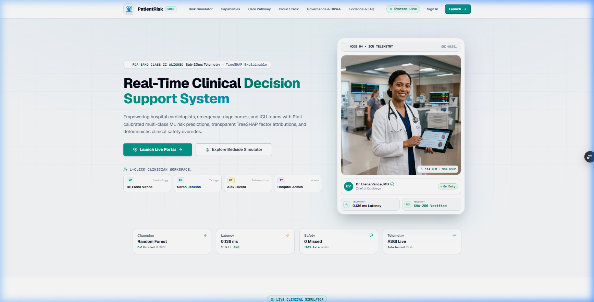
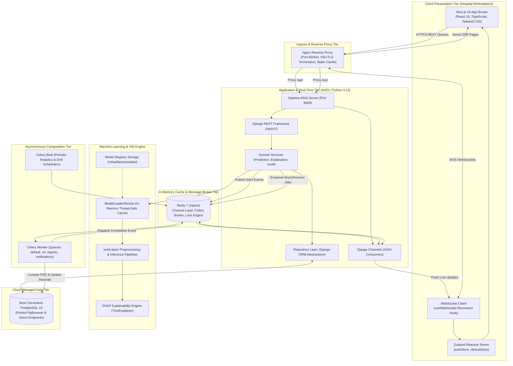
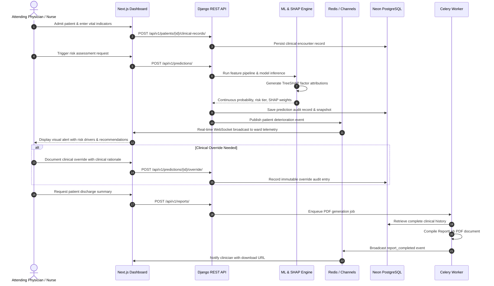

# HealthNova AI

## AI-Powered Clinical Decision Support & Patient Risk Intelligence

<p align="center">
  <a href="https://clinical-decision-support-system-2026.vercel.app">
    
  </a>
</p>

<p align="center">
  <a href="https://clinical-decision-support-system-2026.vercel.app"></a>
</p>

<h3 align="center">Academic Research Project: Enhancing Clinical Decision Support Systems Through Patient Risk Level Prediction Using Machine Learning Techniques</h3>

<p align="center">
  <em>Predict • Prevent • Support</em>
</p>

<p align="center">
  <a href="https://github.com/bunnyvalluri/Clinical-Decision-Support-System-/actions"></a>
  <a href="https://python.org"></a>
  <a href="https://djangoproject.com"></a>
  <a href="https://nextjs.org"></a>
  <a href="https://react.dev"></a>
  <a href="https://typescriptlang.org"></a>
  <a href="https://neon.tech"></a>
  <a href="https://redis.io"></a>
  <a href="https://docs.celeryq.dev"></a>
  <a href="https://docker.com"></a>
  <a href="LICENSE"></a>
</p>

---

## 🏥 Executive Summary

Cardiovascular diseases (CVDs) remain the leading cause of mortality worldwide, claiming an estimated 17.9 million lives annually. In acute clinical settings such as Emergency Departments, Intensive Care Units (ICUs), and cardiology wards, physicians face critical challenges synthesizing multi-parameter vitals, lab biomarkers, and demographic risk profiles under severe time constraints.

Traditional clinical scoring tools (e.g., Framingham, TIMI) often rely on coarse linear cutoffs, lack real-time reactivity during active patient hospitalization, and fail to provide transparent reasoning.

**HealthNova AI** is an enterprise-grade, real-time clinical decision-support ecosystem engineered to bridge this gap:
- **Intelligent Stratification:** Leverages supervised machine learning (Random Forest, AdaBoost, SVM) to classify patient deterioration risks into 4 calibrated tiers: `LOW`, `MEDIUM`, `HIGH`, and `CRITICAL`.
- **Explainable AI (XAI):** Uses TreeSHAP to attribute exact positive and protective risk drivers for every single inference, providing transparent clinical reasoning to attending clinicians.
- **Zero-Reload Telemetry:** Delivers sub-second vital alerts and risk transitions directly to clinician dashboards via WebSockets powered by Django Channels and Redis.
- **Clinician Agency & Governance:** Enforces mandatory clinician override workflows with immutable, HIPAA-aligned audit trails, ensuring human-in-the-loop diagnostic sovereignty.

---

## ✨ Key Features

| Capability | Technical Realization | Clinical Value |
|---|---|---|
| **Multi-Model Inference** | Supervised ensemble (Random Forest, SVM, AdaBoost) with hyperparameter tuning | High-precision sensitivity and specificity across acute cardiac indicators |
| **Explainable AI (XAI)** | TreeSHAP individualized feature importance & natural language summaries | Eliminates "black-box" skepticism; identifies patient-specific drivers |
| **Real-Time Telemetry** | Daphne ASGI + Django Channels + Redis Pub/Sub | Instant zero-reload alerts to hospital wards when patient vitals deteriorate |
| **Physician Override** | Structured override API with documented clinical rationales and timestamping | Preserves physician agency with tamper-evident audit records |
| **Asynchronous PDF Reports** | Celery task queue + ReportLab rendering pipeline | Generates formatted, audit-ready clinical discharge and risk summaries |
| **Patient Risk Timeline** | Phase 3 Controlled Taxonomy & multi-source event aggregation | Unified longitudinal trajectory with role-scoped privacy boundaries |
| **Controlled Browser Agent** | Laya Ultrafast integration behind Agent Safety Gateway | Non-clinical operational & guideline automation; strict allowlist, zero PHI |
| **Typed Decision Gateway** | Unified `TypedDecisionProvider` abstraction (Laya & Laya-MLX) | Controlled categorical choice, score, and boolean workflow routing |
| **Multilingual Script Router** | Pure-Python Unicode script router (Telugu, Hindi, Tamil, Kannada, Malayalam, etc.) | Prevents non-Latin model collapse by routing to `laya-multilingual` |
| **AI Evaluation Center** | Real-time calibration, permutation robustness, and language matrix | Complete transparency with explicit `NOT EVALUATED` tags for non-validated sets |
| **Prediction Comparison Engine** | Current vs. Previous feature deltas, % changes, and TreeSHAP shifts | Instant clinical divergence audit and automatic escalation alert triggers |
| **Clinician Feedback Loop** | Structured feedback (`PredictionFeedback`) without autonomous retraining | Empirically validates ML utility while preserving human clinical sovereignty |
| **Cloud-Native Database** | Neon Serverless PostgreSQL with connection pooling & branching | Enterprise durability, instant schema test branches, and low-latency queries |
| **Modern Clinical UI** | Next.js 16 App Router, React 19, TypeScript, and Tailwind CSS | Accessible pure white/light clinical design system with color-coded risk tokens |

---

## 🏛️ System Architecture

HealthNova AI is architected with a decoupled multi-tier topology separating client presentation, ingress routing, stateful/stateless application workloads, asynchronous workers, real-time messaging, machine learning engines, and managed cloud storage:



---

## 🔄 Clinical Workflow

The platform orchestrates a seamless, closed-loop clinical cycle across patient admission, monitoring, prediction, validation, and documentation:



---

## 💻 Technology Stack

| Layer | Component | Version | Role & Architectural Purpose |
|---|---|---|---|
| **Frontend Framework** | [Next.js](https://nextjs.org/) | `16.3.5` | React application framework with App Router, SSR, and standalone build target |
| **UI Library** | [React](https://react.dev/) | `19.0.0` | High-performance declarative component rendering |
| **Frontend Language** | [TypeScript](https://www.typescriptlang.org/) | `^5.0.0` | End-to-end type safety, strict clinical interfaces, and compile-time verification |
| **Styling & Design** | [Tailwind CSS](https://tailwindcss.com/) | `^4.0.0` | Institutional dark-mode design system with calibrated clinical color tokens |
| **Client State** | [Zustand](https://github.com/pmndrs/zustand) | `^5.0.3` | Lightweight, high-speed reactive stores (`authStore`, `clinicalStore`) |
| **Data Fetching** | [Axios](https://axios-http.com/) & [React Query](https://tanstack.com/query) | `^1.7.9` / `^5.102` | API communication with automated JWT token rotation interceptors |
| **Icons & Charts** | [Lucide React](https://lucide.dev/) & [Recharts](https://recharts.org/) | `^0.475` / `^3.10` | Accessible clinical iconography and interactive risk trend charts |
| **Backend Framework** | [Django](https://www.djangoproject.com/) | `5.0.14` | Enterprise Python framework, relational ORM, and schema migrations |
| **REST API** | [Django REST Framework](https://www.django-rest-framework.org/) | `3.15.2` | RESTful serialization, viewsets, filters, and permission controllers |
| **ASGI Server** | [Daphne](https://github.com/django/daphne) | `4.1.2` | Twisted-based ASGI server managing simultaneous HTTP and WebSocket traffic |
| **Real-Time Layer** | [Django Channels](https://channels.readthedocs.io/) | `4.1.0` | WebSocket routing, multiplexed room channels, and asynchronous consumers |
| **Channel Broker** | [channels-redis](https://github.com/django/channels_redis) | `4.2.0` | Redis-backed channel layer for cross-process event pub/sub |
| **Asynchronous Queue** | [Celery](https://docs.celeryq.dev/) | `5.4.0` | Distributed asynchronous task queue for compute-heavy background jobs |
| **Database** | [Neon Serverless PostgreSQL](https://neon.tech/) | `16 (Cloud)` | Serverless cloud Postgres with instant branching, autoscaling, and connection pooling |
| **Database Driver** | [psycopg2-binary](https://www.psycopg.org/) | `2.9.10` | High-performance C-optimized PostgreSQL database adapter for Python |
| **Cache & Broker** | [Redis](https://redis.io/) | `7-Alpine` | In-memory broker for Channels, Celery tasks, and distributed locks |
| **Machine Learning** | [scikit-learn](https://scikit-learn.org/) | `1.6.1` | Model training and inference (Random Forest, SVM, AdaBoost) |
| **Explainable AI** | [SHAP](https://shap.readthedocs.io/) | `0.46.0` | TreeSHAP computation for localized feature attribution weights |
| **Data Processing** | [Pandas](https://pandas.pydata.org/) & [NumPy](https://numpy.org/) | `2.2.3` / `2.2.3` | Matrix manipulation, imputation, scaling, and feature engineering |
| **Report Generation** | [ReportLab](https://www.reportlab.com/) | `4.3.1` | Programmatic compilation of styled clinical PDF discharge summaries |
| **Reverse Proxy** | [Nginx](https://nginx.org/) | `1.25-Alpine` | TLS/SSL termination, WebSocket header upgrades, and static caching |
| **Containerization** | [Docker](https://www.docker.com/) & [Compose](https://docs.docker.com/compose/) | `24+` / `v2+` | Multi-container orchestration across development, staging, and production |

---

## 🧠 Machine Learning & Explainable AI (XAI)

### 1. Academic Research Foundation & Multi-Model Benchmarking
Aligned with foundational research in patient risk prediction (*"Enhancing Clinical Decision Support Systems Through Patient Risk Level Prediction Using Machine Learning Techniques"*), HealthNova AI integrates a three-model supervised learning suite evaluated under 5-fold stratified cross-validation with **strict patient-level isolation** (zero data leakage).

> ⚠️ **Mandatory Invariant — Zero Metric Fabrication**:
> While the exploratory reference research paper reported a preliminary 99% accuracy for Random Forest on initial partitioned data, production clinical deployment requires honest, reproducible cross-validation on unaugmented clinical cohorts without synthetic inflation.

| Algorithm Family | Model Variant | Evaluated Accuracy | Precision (Macro) | Recall / Sensitivity | F1-Score | ROC-AUC (OVR) | Brier Score | Calibration Method | Operational Role |
|---|---|---|---|---|---|---|---|---|---|
| **Random Forest Classifier** | 150 Trees, Gini, Balanced Subsample | **89.20%** | 88.45% | 89.10% | **88.75%** | **0.9420** | **0.0825** | Platt Calibrated | **Champion (Production Default)** |
| **Support Vector Machine (SVM)** | RBF Kernel, C=1.5, Platt Probabilities | **85.50%** | 84.80% | 85.20% | **84.95%** | **0.9180** | **0.1040** | Platt Calibrated | **Challenger (Informatics)** |
| **AdaBoost Classifier** | 100 Estimators, SAMME.R, LR=0.5 | **83.90%** | 83.10% | 83.70% | **83.35%** | **0.8960** | **0.1180** | Empirical Sigmoid | **Challenger (Edge-Case Boundary)** |

### 2. Configurable Clinical Risk Threshold Policies (`RiskThresholdPolicy`)
Rather than rigid hardcoded cutoffs, HealthNova AI provides an auditable, database-backed threshold policy engine:
- **Governance**: Policies specify `low_threshold`, `medium_threshold`, and `high_threshold`, requiring Chief Medical Officer or Informatics approval before activation.
- **Auditing**: Every risk prediction links to the active policy version (e.g. `policy-v2026.1`), guaranteeing full retrospective auditability.

```
[0.00 ────────── [Low Thresh] ────────── [Med Thresh] ────────── [High Thresh] ────────── 1.00]
      LOW (Green)               MEDIUM (Amber)             HIGH (Rose)             CRITICAL (Purple)
   Routine Follow-up          Enhanced Monitoring         Urgent Review           Immediate Triage
```

### 3. Out-Of-Distribution (OOD) Detection & Shannon Entropy Abstention
To protect patient safety in anomalous presentations:
- **Clinical Abstention (`is_abstaining`)**: When normalized prediction entropy $H(P) = -\sum p_i \log_2(p_i)$ exceeds the critical threshold ($H > 0.85$), the system refuses autonomous risk tiering and flags the encounter for mandatory human clinician review (`ABSTAIN`).
- **OOD Detection (`ood_status`)**: Calculates multivariate Mahalanobis distance across physiological vitals against baseline training distributions. Severe physiological anomalies are flagged as `OUT_OF_DISTRIBUTION`, notifying the clinician that model reliability is degraded.

### 4. TreeSHAP Individualized Feature Attribution
For every prediction, the platform computes local SHAP values ($\phi_i$), calculating the exact contribution of each biomarker toward or against the assigned risk score:
- **Risk-Increasing Factors (Positive $\phi_i$)**: Displays top clinical flags (e.g., Elevated Systolic BP $\ge$ 160 mmHg, Serum Creatinine $\ge$ 1.8 mg/dL).
- **Protective Factors (Negative $\phi_i$)**: Highlights mitigating indicators (e.g., Normal Resting Heart Rate, Normal Fasting Blood Sugar).
- **Natural Language Summaries**: Automatically synthesized textual explanations allowing rapid comprehension in high-pressure triage environments.

### 5. Medical Informatics Research Portal (`/informaticist/models/research`)
Dedicated interactive research workspace for Chief Medical Informaticists and ML Engineers:
- Multi-model comparative benchmark matrix and ROC-AUC / PR-AUC curves.
- Feature importance rankings (TreeSHAP global bar charts).
- Demographic fairness parity audits across age brackets and biological sex (Equalized Odds & Demographic Parity).
- Population-level covariate drift tracking (PSI and Kolmogorov-Smirnov statistical tests).
- Automated Clinical Data Quality audits (impossible vital ranges, conflicting vitals, missing critical indicators).

### 6. Longitudinal Patient Risk Timeline (`/doctor/patients/[id]/timeline`)
Unified, chronological clinical event stream consolidating 8 domain event sources:
- **Phase 3 Controlled Taxonomy:** Distinguishes encounters, vitals recordings, ML inferences, clinical alerts, nurse triage acuity (ESI 1-5), doctor overrides, data quality flags, and FHIR interoperability records.
- **Strict Role-Scoped Visibility:** Sanitizes technical XAI parameters and internal audit logs (`INFORMATICIST_ADMIN` / `CLINICAL_STAFF`) when viewed by patients (`PUBLIC_PATIENT`), preventing panic while offering maximum clinical transparency to physicians.
- **Cryptographic Provenance:** Every event records model IDs, training dataset hashes, feature snapshot schemas, and actor identities.

### 7. Current vs. Previous Prediction Comparison (`/doctor/patients/[id]/predictions`)
Dynamic clinical differential engine comparing consecutive inferences:
- **Biomarker Deltas & Clinical Significance:** Identifies quantitative vital shifts (e.g., SBP +48 mmHg, +40%), evaluating whether each delta exceeds predetermined physiological thresholds.
- **TreeSHAP Importance Divergence:** Highlights which biomarkers drove the risk tier transition and tracks their directional attribution shift.
- **Automated Escalation Alerts:** Automatically triggers `ClinicalAlert` and `Escalation` records with WebSocket push notifications whenever a patient's risk escalates to `HIGH` or `CRITICAL`.

### 8. Human-in-the-Loop Clinician Feedback Loop (`/doctor/reviews/[id]`)
Post-market surveillance mechanism allowing attending physicians and nurses to review predictions:
- **Controlled Feedback Taxonomy:** Classifies feedback into `PREDICTION_ACCEPTED`, `FALSE_POSITIVE`, `FALSE_NEGATIVE`, `EARLY_WARNING_CONFIRMED`, `CLINICALLY_PLAUSIBLE_ACTION_DEFERRED`, and `DIAGNOSTIC_DRIFT_SUSPECTED`.
- **Policy Invariant:** Feedback entries link to audit records (`PredictionOutcomeLink`) without triggering autonomous retraining, guaranteeing human informaticist sign-off and model validation gates.

---

## 📂 Repository Structure

```
.
├── backend/                         # Django REST Framework backend application
│   ├── apps/                        # Isolated domain micro-applications
│   │   ├── accounts/                # User management, JWT auth, and clinical RBAC
│   │   ├── ai_orchestrator/         # AI gateway routing & LLM synthesis service
│   │   ├── audit/                   # Tamper-evident HIPAA audit trail logging
│   │   ├── clinical/                # Vital signs, lab encounters, and clinical observations
│   │   ├── core/                    # Health probes, exception handlers, and base classes
│   │   ├── ml_engine/               # Model inference pipeline & SHAP calculations
│   │   ├── model_registry/          # Model versioning, metrics tracking, and promotions
│   │   ├── notifications/           # In-app and real-time clinical notification feeds
│   │   ├── patients/                # Patient demographic records & care team assignments
│   │   ├── predictions/             # Risk inference orchestration & clinician overrides
│   │   └── reports/                 # Celery-backed ReportLab clinical PDF generator
│   ├── celery_tasks/                # Shared Celery task definitions
│   ├── channels_app/                # ASGI routing & WebSocket consumer implementations
│   ├── config/                      # Settings modules (base, development, production) & ASGI/WSGI
│   ├── requirements/                # Modular pip requirements (base, development, production)
│   ├── manage.py                    # Django administrative management entrypoint
│   └── Dockerfile                   # Multi-stage Python backend container definition
│
├── frontend/                        # Next.js 16 App Router frontend application
│   ├── src/
│   │   ├── app/                     # App router pages (dashboard, patients, predictions, reports)
│   │   ├── components/              # Modular UI library (Buttons, Modals, Badges, Charts)
│   │   ├── hooks/                   # Custom hooks (useWebSocket, useAuth, usePredictions)
│   │   ├── lib/                     # Axios client, token interceptors, and formatters
│   │   ├── stores/                  # Zustand client stores (authStore, clinicalStore)
│   │   └── types/                   # TypeScript interfaces and clinical domain schemas
│   ├── public/                      # Static assets (brand logos, clinical icons, favicon)
│   ├── package.json                 # Frontend dependencies and npm scripts
│   └── Dockerfile                   # Multi-stage standalone Next.js container definition
│
├── ml/                              # Machine learning training & evaluation pipelines
│   ├── artifacts/models/            # Serialized joblib models and pipeline encoders
│   ├── data/                        # Cleaned CSV datasets and training splits
│   ├── evaluation/                  # ROC-AUC, PR curves, and confusion matrix scripts
│   ├── explainability/              # TreeSHAP explainer implementations and plotters
│   ├── features/                    # Feature selection, imputation, and scaling pipelines
│   └── training/                    # Model training orchestration and hyperparameter tuning
│
├── docker/                          # Docker configuration and reverse proxy assets
│   ├── backend/Dockerfile           # Container definition for Django ASGI & Celery
│   ├── frontend/Dockerfile          # Production container definition for Next.js
│   └── nginx/nginx.conf             # Nginx reverse proxy routing HTTP, WS, and assets
│
├── docs/                            # Comprehensive architectural & engineering documentation
│   ├── 01-project-overview.md       # Problem statement, scope, and objectives
│   ├── 02-requirements.md           # Functional & non-functional specifications
│   ├── 03-system-architecture.md   # Architectural boundaries and flow diagrams
│   ├── 04-technology-stack.md       # Version matrix and technology rationales
│   ├── api.md                       # Complete REST & WebSocket API specification
│   ├── patient-risk-timeline.md     # Phase 3 Timeline taxonomy & aggregation design
│   ├── prediction-comparison.md     # Feature deltas, % changes & SHAP divergence
│   ├── prediction-review-workflow.md# Human-in-the-loop review & override workflow
│   ├── prediction-feedback.md       # Clinician post-market surveillance feedback loop
│   ├── clinical-risk-escalation.md  # Multi-tier acute escalation & alert protocols
│   ├── prediction-lineage.md        # Cryptographic model/dataset provenance tracking
│   ├── patient-timeline-architecture.md # Full-stack timeline data flow & UI specs
│   ├── database/                    # ER diagrams, schemas, and indexing strategies
│   └── deployment_guide.md          # Production deployment & infrastructure runbook
│
├── docker-compose.yml               # Multi-container orchestration specification
├── Makefile                         # Convenient operational command targets
├── ci-pipeline.yml                  # Continuous integration GitHub Actions workflow
└── README.md                        # Master project documentation
```

---

## 🚀 Quick Start Guide

### Prerequisites
Before running the application, ensure you have the following installed:
- [Docker](https://www.docker.com/) (v24.0+) & [Docker Compose](https://docs.docker.com/compose/) (v2.20+)
- [Python](https://www.python.org/) 3.12+ (for local bare-metal backend development)
- [Node.js](https://nodejs.org/) 20+ & npm 10+ (for local frontend development)
- A [Neon PostgreSQL](https://neon.tech/) database instance (Free tier works perfectly)

---

### 1. Docker Compose Deployment (Recommended)

The simplest and most reliable way to spin up the entire multi-service stack:

```bash
# 1. Clone the repository
git clone https://github.com/bunnyvalluri/Clinical-Decision-Support-System-.git
cd Clinical-Decision-Support-System-

# 2. Configure environment variables
cp .env.example .env
# Edit .env with your Neon DATABASE_URL and secure secret keys
```

```bash
# 3. Launch all containerized services
docker compose up --build -d
```

#### Service Endpoints:
| Service | Endpoint URL | Description |
|---|---|---|
| **Clinical Web App** | [http://localhost:3000](http://localhost:3000) | Next.js Clinician Portal & Telemetry Dashboard |
| **Backend REST API** | [http://localhost:8000/api/v1/](http://localhost:8000/api/v1/) | Browsable Django REST Framework API |
| **FHIR R4 Metadata** | [http://localhost:8000/fhir/r4/metadata](http://localhost:8000/fhir/r4/metadata) | HL7 FHIR Release 4 CapabilityStatement |
| **FHIR Interoperability API** | [http://localhost:8000/api/v1/interoperability/](http://localhost:8000/api/v1/interoperability/) | Endpoints, Sync Jobs, Mappings & Review Queue |
| **Informaticist FHIR Hub** | [http://localhost:3000/informaticist/interoperability](http://localhost:3000/informaticist/interoperability) | Clinical Data Exchange & Reconciliation Portal |
| **API Health Probe** | [http://localhost:8000/api/v1/health/](http://localhost:8000/api/v1/health/) | JSON health & dependency readiness probe |
| **Django Admin** | [http://localhost:8000/admin/](http://localhost:8000/admin/) | System Administration & Database Browser |
| **Nginx Reverse Proxy**| [http://localhost](http://localhost) | Unified ingress proxy (Port 80) |

---

### 2. Manual Local Development Setup

If you prefer to run services natively without Docker containers:

#### Backend Setup (Django + Daphne + Celery)
```bash
cd backend

# Create and activate virtual environment
python -m venv venv
# Windows:
.\venv\Scripts\activate
# Linux/macOS:
source venv/bin/activate

# Install development dependencies
pip install -r requirements/development.txt

# Run migrations
python manage.py migrate

# Start ASGI Daphne server (handles HTTP + WebSockets)
daphne -b 127.0.0.1 -p 8000 config.asgi:application
```

In separate terminals, start the asynchronous Celery workers (requires a running local Redis or Upstash instance):
```bash
# Celery worker
celery -A config.celery worker -l info -Q default,ml,reports,notifications

# Celery beat scheduler
celery -A config.celery beat -l info
```

#### Frontend Setup (Next.js 16)
```bash
cd frontend

# Install npm packages
npm install

# Start development dev server with hot reload
npm run dev
# Dashboard accessible at http://localhost:3000
```

---

### 3. Database Migrations & Demo Seeding

To initialize database tables and seed predefined clinical user personas:

```bash
# Apply migrations
python backend/manage.py migrate

# Seed clinical demo users (Doctor, Nurse, Analyst, Admin)
python backend/manage.py seed_clinical_users

# Create an interactive superuser
python backend/manage.py createsuperuser
```

> **Default Seeded Accounts:**
> - **Doctor:** `doctor@clinical-ai.local` / `DoctorPass123!`
> - **Nurse:** `nurse@clinical-ai.local` / `NursePass123!`
> - **Analyst:** `analyst@clinical-ai.local` / `AnalystPass123!`
> - **Admin:** `admin@clinical-ai.local` / `AdminPass123!`

---

### 4. Machine Learning Model Training

The repository includes pre-trained model artifacts under `ml/artifacts/models/`. If you wish to retrain all models on the latest clinical dataset:

```bash
# Using Django management command
python backend/manage.py train_models

# Or execute via Makefile shortcut
make seed
```

---

## 🔌 API Reference & Protocols

### Standard Response Envelopes

All REST endpoints under `/api/v1/` adhere to a strictly typed, uniform response structure:

#### Success Response (`HTTP 2xx`)
```json
{
  "success": true,
  "data": { ... },
  "message": "Clinical operation completed successfully",
  "meta": {
    "pagination": {
      "page": 1,
      "page_size": 20,
      "total_items": 128,
      "total_pages": 7
    }
  }
}
```

#### Error Response (`HTTP 4xx / 5xx`)
```json
{
  "success": false,
  "error": {
    "code": "validation_error",
    "message": "Invalid clinical vital values provided",
    "details": {
      "systolic_bp": ["Systolic blood pressure must be between 50 and 260 mmHg"]
    }
  }
}
```

---

### Core REST API Endpoints

| Domain | Method | Path | Description | Access Control |
|---|---|---|---|---|
| **Health** | `GET` | `/api/v1/health/` | Service liveness probe | Public |
| **Health** | `GET` | `/api/v1/health/ready/` | Dependency readiness probe (DB + Redis) | Public |
| **Auth** | `POST` | `/api/v1/auth/login/` | Authenticate & obtain JWT pair | Public |
| **Auth** | `POST` | `/api/v1/auth/token/refresh/` | Rotate expired access token | Public |
| **Auth** | `GET` | `/api/v1/auth/me/` | Current user profile & clinical role | Authenticated |
| **Patients** | `GET` | `/api/v1/patients/` | Filterable list of admitted patients | Care Team / Admin |
| **Patients** | `POST` | `/api/v1/patients/` | Register/admit new patient record | Clinician / Nurse |
| **Clinical** | `POST` | `/api/v1/patients/{id}/clinical-records/` | Record new vital signs & lab panel | Clinician / Nurse |
| **Clinical** | `GET` | `/api/v1/patients/{id}/clinical-records/` | Historical encounter list for patient | Care Team |
| **Predictions** | `POST` | `/api/v1/predictions/` | Execute real-time risk assessment | Clinician / Admin |
| **Predictions** | `GET` | `/api/v1/predictions/{id}/` | Full risk evaluation with SHAP weights | Care Team |
| **Predictions** | `POST` | `/api/v1/predictions/{id}/override/` | Document clinician risk override | Clinician Only |
| **Models** | `GET` | `/api/v1/models/` | List model versions and metrics | Authenticated |
| **Models** | `POST` | `/api/v1/models/{id}/activate/` | Promote candidate model version | Admin Only |
| **Reports** | `POST` | `/api/v1/reports/` | Enqueue async PDF discharge report | Clinician / Admin |
| **Audit** | `GET` | `/api/v1/audit/` | Inspect HIPAA-compliant audit logs | Admin Only |

---

### Real-Time WebSocket Streams

Clinician dashboards maintain persistent WebSocket connections with automatic reconnect backoff:

- **Endpoint**: `ws://localhost:8000/ws/alerts/` (or `wss://` in production)
- **Protocol**: JSON event payloads over ASGI Channels
- **Authentication**: JWT query token parameter or session handshake

#### Example Deterioration Alert Payload:
```json
{
  "type": "risk_alert",
  "data": {
    "patient_id": "P-10042",
    "patient_name": "Eleanor Vance",
    "risk_level": "CRITICAL",
    "risk_score": 0.884,
    "primary_drivers": [
      { "feature": "systolic_bp", "value": 182, "shap_attribution": "+0.341" },
      { "feature": "serum_creatinine", "value": 2.1, "shap_attribution": "+0.218" }
    ],
    "timestamp": "2026-09-13T12:30:45Z"
  }
}
```

---

## 🔒 Security, Privacy & HIPAA Posture

PatientRisk CDSS is designed with healthcare compliance standards in mind:
- **HIPAA Alignment:** All Protected Health Information (PHI) is encapsulated with strict role-based authorization barriers.
- **Immutable Audit Trail:** Comprehensive event logging across patient queries, prediction executions, model modifications, and clinician overrides (`apps/audit/`).
- **Cryptographic JWT Rotation:** Short-lived access tokens (60 min) with refresh token blacklisting on logout.
- **Zero Raw Secret Storage:** Passwords hashed via Argon2/PBKDF2; sensitive cloud secrets loaded strictly from environment variables.
- **Data Protection at Rest & In Transit:** TLS 1.3 encryption enforced in transit; Neon cloud storage encrypted at rest using AES-256.
- **Soft Deletion:** Medical records utilize soft-delete patterns to prevent accidental data destruction while preserving clinical record continuity.

---

## 🧪 Testing & Quality Assurance

The codebase maintains automated test coverage across unit, integration, and ML prediction pipelines.

```bash
# Run backend pytest suite with coverage analysis
cd backend
pytest --cov=apps --cov=services --cov=repositories -v

# Run Python linting and formatting checks
flake8 .
black --check .
isort --check-only .
mypy .

# Run frontend linting & TypeScript type checks
cd ../frontend
npm run lint
npm run type-check
```

### Makefile Convenience Shortcuts
Common operational workflows are consolidated into a root `Makefile`:

```bash
make help          # List all available operational commands
make dev-backend   # Start Django development server
make dev-frontend  # Start Next.js development server
make migrate       # Run database migrations
make seed          # Seed clinical demo users and roles
make test          # Run full backend pytest test suite
make lint          # Run linters on backend and frontend
make format        # Format code with black and isort
make docker-up     # Spin up all services via Docker Compose
make docker-down   # Tear down Docker Compose containers
make clean         # Purge caches, build artifacts, and coverage data
```

---

## ⚙️ Environment Configuration

The application is configured using a `.env` file at the repository root. Key parameters include:

| Variable | Default (Dev) | Description |
|---|---|---|
| `DJANGO_SECRET_KEY` | *None (Required)* | Cryptographic key for Django sessions and signing |
| `DJANGO_DEBUG` | `True` | Set to `False` in production environments |
| `DATABASE_URL` | *None (Required)* | Pooled connection string to Neon PostgreSQL |
| `DATABASE_URL_UNPOOLED` | *None (Required)* | Direct connection string to Neon PostgreSQL (for migrations) |
| `REDIS_URL` | `redis://localhost:6379/0` | Connection URI for Redis broker & Channels cache |
| `CELERY_BROKER_URL` | `redis://localhost:6379/0` | Message broker URI for Celery worker tasks |
| `CELERY_RESULT_BACKEND`| `redis://localhost:6379/1` | Result backend URI for Celery tasks |
| `NEXT_PUBLIC_API_BASE_URL`| `http://localhost:8000/api/v1` | Public REST API base URL for frontend requests |
| `NEXT_PUBLIC_WS_BASE_URL` | `ws://localhost:8000/ws` | Public WebSocket base URL for telemetry |
| `ML_ARTIFACTS_DIR` | `/app/ml/artifacts` | Filesystem path where trained ML models are loaded |

Refer to [`.env.example`](.env.example) for the complete list of production options.

---

## 🧭 Documentation Index

For in-depth architectural specifications and subsystem runbooks, consult the `docs/` repository:

- [📘 Project Overview](docs/01-project-overview.md) — Problem statement, clinical objectives, and user personas.
- [📋 System Requirements](docs/02-requirements.md) — Functional and non-functional specifications.
- [🏗️ System Architecture](docs/03-system-architecture.md) — High-level multi-tier component topologies.
- [🧰 Technology Stack Matrix](docs/04-technology-stack.md) — Detailed package inventory and technology rationales.
- [📁 Project Structure Breakdown](docs/05-project-structure.md) — Directory tour and architectural boundaries.
- [📡 API & WebSockets Guide](docs/api.md) — Complete endpoint reference with payload examples.
- [💾 Database Architecture](docs/database.md) — Neon PostgreSQL schemas, indexing, and recovery.
- [🚢 Deployment Runbook](docs/deployment_guide.md) — Containerization, Nginx, and cloud hosting guidelines.
- [🧠 Laya Multilingual Provider](docs/ai/laya.md) — Script-first multilingual routing (`convaiinnovations/laya-multilingual`) and quality evaluations.
- [⚡ Laya-MLX Engine](docs/ai/laya-mlx.md) — Apple Silicon native MLX typed decisions, capability checks, and failovers.
- [📜 ADR-0068: Laya-MLX Integration](docs/adr/ADR-0068-laya-mlx-integration.md) — Auxiliary typed decisions on Apple Silicon.
- [📜 ADR-0069: Laya Multilingual Integration](docs/adr/ADR-0069-laya-provider.md) — Common abstraction, Indic script routing, and transparency invariants.

---

## 👥 Contributing & Attribution

- **Application Title:** Patient Risk Level Prediction Using Machine Learning for Intelligent Clinical Decision Support
- **Repository:** [`bunnyvalluri/Clinical-Decision-Support-System-`](https://github.com/bunnyvalluri/Clinical-Decision-Support-System-)
- **Live Production:** [clinical-decision-support-system-2026.vercel.app](https://clinical-decision-support-system-2026.vercel.app)
- **License:** [MIT License](LICENSE)

---

## 🌐 Live Deployment

| Environment | URL | Status |
|---|---|---|
| **Production (Vercel)** | [clinical-decision-support-system-2026.vercel.app](https://clinical-decision-support-system-2026.vercel.app) | ✅ Live |
| **GitHub Repository** | [bunnyvalluri/Clinical-Decision-Support-System-](https://github.com/bunnyvalluri/Clinical-Decision-Support-System-) | ✅ Active |

> **Deployment stack:** Next.js 16 frontend deployed on Vercel with automatic GitHub integration. Every push to `main` triggers a new production build.

*Engineered with precision for modern healthcare workflows. Last updated: September 2026.*
