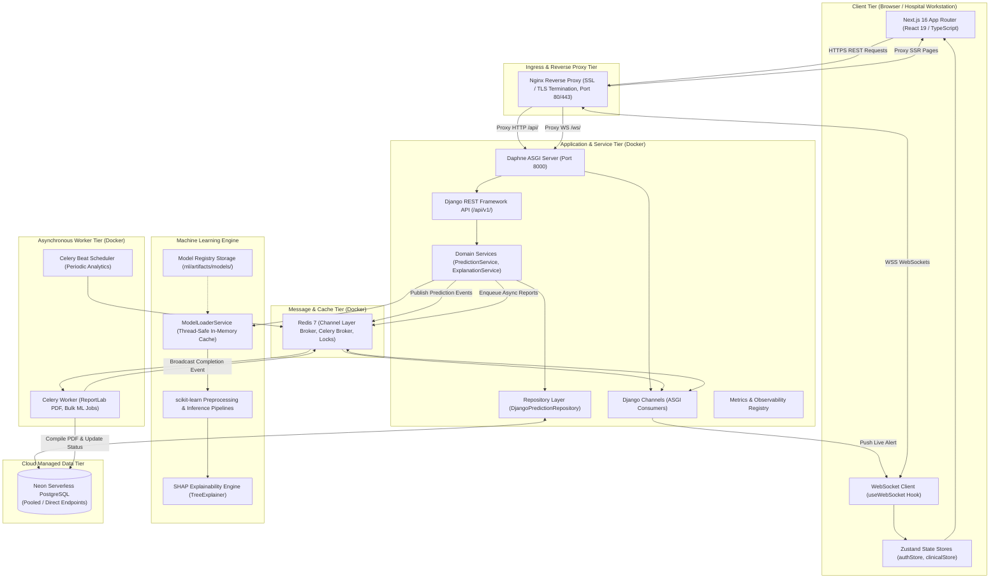

# 03. System Architecture

This document describes the end-to-end system architecture of the PatientRisk Clinical Decision Support System, explaining component boundaries, data pathways, and execution paradigms.

---

## 1. High-Level Architecture Diagram

---

## 2. Component Descriptions

### 2.1 Frontend Client Tier
- Built with **Next.js 16 (App Router)** and **React 19** in strict **TypeScript**.
- Styled with modern **Vanilla Tailwind CSS**, implementing an institutional clinical dark-mode aesthetic with custom color-coded risk tokens (`emerald`, `amber`, `rose`, `purple`).
- Uses **Zustand** stores (`authStore`, `clinicalStore`) to manage reactive state without unnecessary re-renders.
- Includes a resilient WebSocket connection hook with exponential backoff reconnect logic.

### 2.2 Ingress & Reverse Proxy (Nginx)
- Terminates TLS/HTTPS connections with modern cipher suites.
- Performs WebSocket header translation (`Upgrade $http_upgrade`, `Connection "upgrade"`).
- Directly serves pre-compiled static assets with 30-day cache headers, bypassing the Python ASGI application.
- Applies strict HTTP security headers: `X-Frame-Options: DENY`, `X-Content-Type-Options: nosniff`, and restrictive `Content-Security-Policy`.

### 2.3 Application Tier (Django & Daphne ASGI)
- Serves both synchronous REST endpoints (`/api/v1/`) and asynchronous WebSocket consumers (`/ws/dashboard/`, `/ws/alerts/`).
- Follows a strict **Service Layer Pattern**: controllers/views validate parameters and delegate domain logic to specialized service classes (`PredictionService`, `ExplanationService`).
- Uses a **Repository Pattern** (`DjangoPredictionRepository`) to abstract ORM data fetching, ensuring loose coupling and testability.

### 2.4 Machine Learning Engine
- Features an active in-memory cache managed by `ModelLoaderService` to avoid expensive disk I/O on every inference request.
- Combines feature imputation, standard scaling, and scikit-learn models into serialized joblib pipelines.
- Embeds SHAP TreeExplainer to calculate exact additive contributions for every vital sign and clinical biomarker.

### 2.5 Real-Time & Background Infrastructure (Redis & Celery)
- **Redis:** Operates as the centralized message broker for Celery queues, the distributed result backend, the Django Channels channel layer, and distributed idempotency locking.
- **Celery Worker:** Executes long-running tasks asynchronously (PDF discharge summaries, model retraining jobs, bulk predictions) with idempotency locks preventing duplicate runs.

### 2.6 Managed Cloud Database (Neon PostgreSQL)
- Cloud-native serverless PostgreSQL utilizing separate endpoints:
  - **Pooled Endpoint (`-pooler`):** Utilized by high-concurrency web requests via PgBouncer.
  - **Direct Endpoint:** Utilized for schema migrations (`migrate`) and DDL operations.
