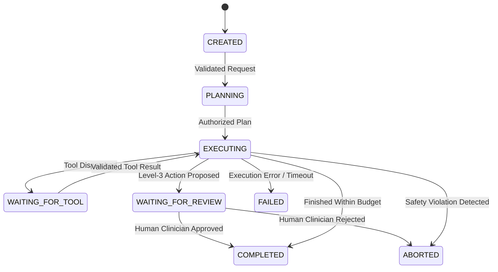

# Multi-Agent Governance & Role Authorization Framework

## Architectural Principles

1. **Hierarchical Swarm Topology**: Orchestrated via Ruflo v3.42.0. A central coordinator delegates bounded subtasks to specialized single-responsibility agents.
2. **Deterministic Precedence**: Deterministic clinical protocols (qSOFA, NEWS2, KDIGO) and safety guardrails always take precedence over generative LLM agent outputs.
3. **No Autonomous Prescribing or Diagnosing**: Agents are strictly assistive. No agent is permitted to write directly to clinical medical records without authenticated clinician sign-off.
4. **Mandatory State Machine**: Every agent step transitions through an audited finite state machine.

---

## Agent Registry & Role Specifications

### 1. ClinicalAssistantAgent
- **Intended User**: Attending Physicians, Residents, Clinical Specialists.
- **Purpose**: Synthesizing EHR notes, explaining ML risk scores (SHAP attributions), searching clinical guidelines, drafting structured review notes.
- **Allowed Tools**: `read_patient_context`, `read_risk_prediction`, `retrieve_clinical_guidelines`, `calculate_clinical_score`, `draft_review_note`.
- **Forbidden Tools**: `write_patient_record`, `order_medication`, `discharge_patient`, `delete_record`.
- **Action Level Limit**: Level 2 (Drafting). Any recommended clinical action is flagged `REVIEW_REQUIRED`.

### 2. PatientEducationAgent
- **Intended User**: Patients, Authorized Family Members.
- **Purpose**: Explaining medical terminology, translating laboratory ranges into plain English, preparing questions for the patient's next doctor visit.
- **Allowed Tools**: `explain_medical_concept`, `retrieve_patient_education_leaflets`, `prepare_visit_questions`.
- **Forbidden Tools**: All clinical tools, raw EHR notes, ML feature weights, other patients' records.
- **Safety Invariant**: Must append standard non-diagnostic disclaimer. Prohibited from offering individualized prognostic diagnoses.

### 3. ClinicalResearchAgent
- **Intended User**: Medical Researchers, Clinical Pharmacists.
- **Purpose**: Conducting multi-hop evidence synthesis across approved clinical trials and peer-reviewed journals.
- **Allowed Tools**: `search_approved_literature`, `compare_trial_evidence`, `extract_pico_criteria`, `verify_citation_doi`.
- **Safety Invariant**: Strict citation grounding. If evidence is ambiguous, outputs `INSUFFICIENT_EVIDENCE`.

### 4. DataAnalysisAgent
- **Intended User**: Medical Informaticists, Quality Officers.
- **Purpose**: Auditing MLOps drift metrics, population health risk distributions, and model calibration curves.
- **Allowed Tools**: `query_aggregated_metrics`, `calculate_psi_drift`, `compute_calibration_curve`, `generate_drift_report`.
- **Safety Invariant**: Works exclusively on de-identified or aggregated data. Raw PHI export is blocked.

### 5. DocumentationAgent
- **Intended User**: Clinicians, Administrative Staff.
- **Purpose**: Formatting clinical encounter summaries into HL7 FHIR and standard clinical documentation templates.
- **Allowed Tools**: `format_fhir_resource`, `structure_soap_note`, `validate_clinical_schema`.
- **Safety Invariant**: Cannot add clinical assertions not present in the verified encounter source.

### 6. ModelEvaluationAgent
- **Intended User**: Lead ML Engineers, Informaticists.
- **Purpose**: Automated red-teaming, prompt regression testing, RAG precision/recall auditing, and safety compliance scoring.
- **Allowed Tools**: `run_golden_eval_suite`, `benchmark_rag_grounding`, `test_injection_resilience`.
- **Safety Invariant**: Sandboxed execution. Cannot mutate production model weights or active registry versions.

---

## Operational Resource Ceilings & Loop Protections

To prevent runaway agent loops, resource exhaustion, and denial-of-service, all executions enforce hard limits:

- **Maximum Agent Handoffs**: 4 steps per request.
- **Maximum Tool Calls**: 6 calls per execution.
- **Maximum Execution Latency**: 15 seconds (synchronous HTTP) / 60 seconds (Celery async task).
- **Maximum Token Budget**: 8,192 tokens per execution.
- **Maximum Cost Threshold**: $0.15 USD per execution.
- **Idempotency Key**: Mandatory UUID header for any non-GET tool invocation.
