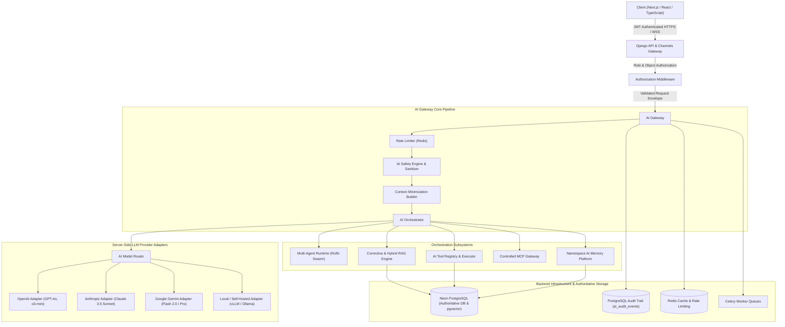

# HealthNova AI Platform Architecture (BPY-CSE-2666)

## System Overview

The HealthNova AI Platform is a clinical decision-support and medical knowledge retrieval ecosystem built atop the BPY-CSE-2666 Machine Learning risk-prediction system. It provides controlled generative intelligence, conversational decision support, structured summaries, and evidence-grounded literature retrieval for clinicians, nurses, informaticists, patients, and system administrators.

---

## The AI Request Pipeline

Every incoming AI request executes through an immutable 14-stage pipeline:

1. **Authentication**: JWT token validation, user signature verification, token expiration check.
2. **Role & Object Authorization**: Strict verification that user role (Doctor, Nurse, Patient, Informaticist, Admin) permits the operation, and tenant check (e.g. Patient A cannot query Patient B's data).
3. **Input Validation**: Schema parsing, maximum length bounds (4,096 chars per prompt), forbidden character inspection.
4. **Privacy Classification**: Determination of data sensitivity tier (`PUBLIC`, `LOW_SENSITIVITY`, `SENSITIVE`, `PHI`, `HIGHLY_SENSITIVE`).
5. **Prompt Safety & Injection Defense**: Regex and heuristic scanning for instruction override attempts, jailbreaks, and indirect injection vectors.
6. **Context Retrieval**: Controlled querying of relevant patient vitals or approved clinical literature using strict minimization.
7. **Tool Authorization**: Verification that any tool called during orchestration exists in the agent's pre-approved allowlist.
8. **Provider Routing**: Selection of the optimal approved model based on task complexity, cost budget, and privacy tier.
9. **Inference Execution**: Execution with strict timeout (15s HTTP / 30s async), token budget ceilings, and automatic safe retries.
10. **Output Schema Validation**: Enforcing Pydantic structured output models (`ClinicalSummaryOutput`, `EvidenceSpan`).
11. **Grounding & Citation Verification**: Verifying that all generated claims map directly to retrieved knowledge documents.
12. **Safety Policy Audit**: Deterministic rule cross-checks (qSOFA, NEWS2) and clinical guardrail inspection.
13. **Immutable Audit Persistence**: Writing trace records, tool calls, and token usage into Neon PostgreSQL.
14. **Safe Response Delivery**: Broadcasting structured event envelopes over REST or Django Channels WebSockets.

---

## Action Level Taxonomy

Operations in the AI system are classified into six discrete risk tiers:

| Action Level | Description | Permitted Agent Execution | Human Approval Required? | Clinical Example |
| :--- | :--- | :--- | :--- | :--- |
| **LEVEL 0** | Read-Only Informational | Fully Autonomous | No | Searching approved clinical guidelines, explaining medical terms. |
| **LEVEL 1** | Analysis & Aggregation | Fully Autonomous | No | Calculating risk scores, summarizing patient vital trends, calculating PSI drift. |
| **LEVEL 2** | Draft Preparation | Autonomous Draft | No (Draft only) | Generating draft clinical review notes for physician signature. |
| **LEVEL 3** | Human-Approved Action | Blocked until Human Sign-off | **YES (Mandatory)** | Sending alert notifications to attending physician, ordering labs. |
| **LEVEL 4** | Restricted Admin Action | Blocked until Multi-Admin Gate | **YES (2-Person Rule)** | Promoting retrained ML model to production, altering institutional guideline index. |
| **LEVEL 5** | Autonomous Medical Order | **PERMANENTLY FORBIDDEN** | N/A | Autonomous medical diagnosis, changing medication dosages, autonomous clinical discharge. |

---

## Technical Component Hierarchy

- **`backend/ai/domain/`**: Value objects, risk tiers, grounding metrics, and domain entities.
- **`backend/ai/providers/`**: Pluggable provider adapters (`OpenAIProvider`, `AnthropicProvider`, `GeminiProvider`, `LocalModelProvider`).
- **`backend/ai/gateway/`**: Gateway enforcing rate limits, circuit breakers, fallback trees, and token budgeting.
- **`backend/ai/safety/`**: The `AISafetyEngine` evaluating injection attempts, PHI masking, and clinical invariants.
- **`backend/ai/rag/`**: The RAG subsystem containing hybrid indexers, chunkers, reciprocal rank fusion, and corrective retrieval loops.
- **`backend/ai/tools/`**: `AIToolRegistry` and `ToolExecutor` executing only validated, authorized, and audited tools.
- **`backend/ai/mcp/`**: `MCPGateway` and server registry interfacing with external tools using default-deny security.
- **`backend/ai/memory/`**: Namespace-partitioned AI memory enforcing TTLs, tenant scoping, and zero PHI persistence.
- **`backend/ai/agents/`**: Role-specialized agents (`ClinicalAssistantAgent`, `PatientEducationAgent`, `ClinicalResearchAgent`, `DataAnalysisAgent`, `DocumentationAgent`, `ModelEvaluationAgent`).
- **`backend/ai/orchestrator/`**: Multi-agent coordinator managing Ruflo state transitions, loop bounds, and WebSocket event broadcasts.
