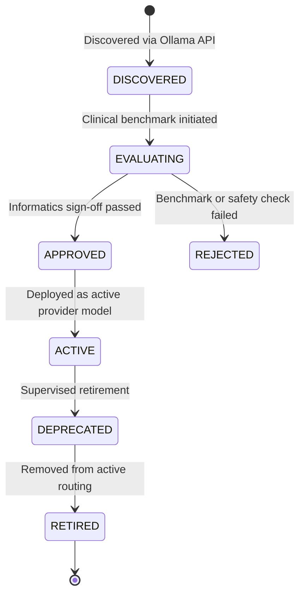

# Ollama Model Catalog & Lifecycle Management

## 1. Supported Model Profiles

| Model Identifier | Parameter Count | Quantization | Min RAM/VRAM | Primary Role | Context Window |
| :--- | :--- | :--- | :--- | :--- | :--- |
| `llama3.3:8b-instruct-q4_K_M` | 8B | Q4_K_M | 8 GB | Clinical summarization, triage reasoning | 8,192 |
| `llama3.3:70b-instruct-q4_K_M`| 70B | Q4_K_M | 40 GB | Complex differential explanation | 16,384 |
| `qwen2.5:7b-instruct-q4_K_M`  | 7B | Q4_K_M | 8 GB | Structured JSON generation, tool calling | 8,192 |
| `mistral:7b-instruct-v0.3`    | 7B | Q4_K_M | 8 GB | General clinical assistant | 8,192 |
| `deepseek-r1:8b`              | 8B | Q4_K_M | 8 GB | Step-by-step clinical chain-of-thought | 8,192 |
| `nomic-embed-text:latest`     | 137M | F16 | 2 GB | Clinical guidelines & notes embedding (768-dim) | 8,192 |
| `bge-m3:latest`               | 567M | F16 | 4 GB | Multilingual medical literature embedding (1024-dim) | 8,192 |

## 2. Model Lifecycle States in Neon PostgreSQL

### State Definitions
1. **`DISCOVERED`**: Model detected in local Ollama daemon or pulled via background task; not routed to any clinical users.
2. **`EVALUATING`**: Automated toxicity, clinical hallucination, and prompt injection benchmarks in progress.
3. **`APPROVED`**: Medical informaticist / security administrator has signed off on model usage.
4. **`ACTIVE`**: Model enabled for clinical routing based on approved user roles (`DOCTOR`, `CLINICAL_INFORMATICIST`, `ADMIN`).
5. **`DEPRECATED`**: Model scheduled for removal; routing priority demoted.
6. **`RETIRED`**: Blocked from further inference requests.
