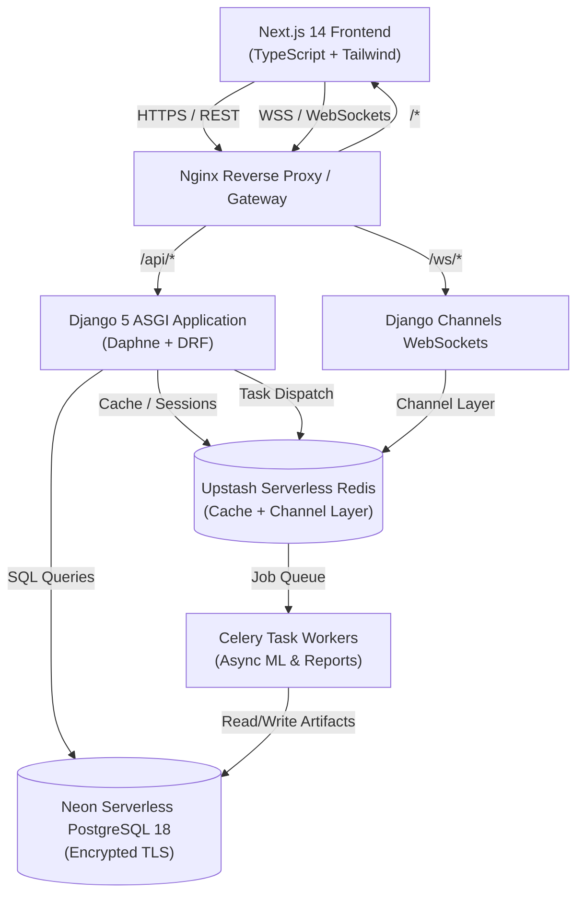

# System Architecture Documentation
**Project**: BPY-CSE-2666 — Patient Risk Level Prediction System  
**Application Title**: Patient Risk Level Prediction Using Machine Learning for Intelligent Clinical Decision Support

---

## 1. Architectural Overview

The application is structured as a modular, scalable, and maintainable healthcare-grade monorepo combining a high-performance Python/Django backend with a modern React/Next.js frontend.



---

## 2. Monorepo Directory Organization

```text
project-root/
├── frontend/             # Next.js 14 + TypeScript + Tailwind CSS UI
│   ├── src/
│   │   ├── app/          # App router pages & layouts
│   │   ├── components/   # UI primitives and shared components
│   │   ├── features/     # Feature-sliced domain modules (auth, dashboard, patients)
│   │   ├── services/     # Axios API clients
│   │   ├── hooks/        # Custom React hooks (WebSockets, auth)
│   │   ├── types/        # Domain TypeScript interfaces
│   │   ├── utils/        # Clinical formatters and risk score mappers
│   │   └── lib/          # Utilities and shared helpers
├── backend/              # Django 5 REST Framework modular backend
│   ├── config/           # Django settings, ASGI, WSGI, Celery
│   ├── apps/
│   │   ├── accounts/     # User authentication, JWT, profiles, admin
│   │   ├── core/         # Base models, middleware, responses, health
│   │   ├── patients/     # EHR patient records
│   │   ├── clinical/     # Clinical encounters and vitals observations
│   │   ├── predictions/  # Real-time risk inference endpoints
│   │   ├── ml_engine/    # ML model training and evaluation engine
│   │   ├── model_registry/ # Versioned ML model artifacts
│   │   ├── notifications/# Alert delivery & WebSockets broadcast
│   │   ├── reports/      # PDF/CSV clinical report generation
│   │   └── audit/        # HIPAA audit log exploration
│   ├── common/           # Shared base models, exceptions, pagination
│   ├── celery_tasks/     # Asynchronous worker task definitions
│   ├── channels_app/     # WebSocket consumers and routing
│   └── tests/            # Pytest automated test suites
├── infrastructure/       # Container and gateway configurations
│   ├── docker/           # Production Dockerfiles (multi-stage)
│   └── nginx/            # Reverse proxy and load balancing
├── docs/                 # System architecture, API, and database specifications
├── scripts/              # Local setup and development runners
├── Makefile              # Developer command orchestration
├── docker-compose.yml    # Multi-container local orchestration
├── .env.example          # Safe environment variables template
└── README.md             # Project quickstart and technical summary
```

---

## 3. Clinical Role-Based Access Control (RBAC)

| Role | Target Persona | Access Permissions |
| :--- | :--- | :--- |
| **`ADMIN`** | Hospital System Administrator | Full access to user accounts, audit logging, system telemetry, and configuration. |
| **`DOCTOR`** | Physician / Cardiologist | Full EHR read/write, run ML risk predictions, record clinical overrides, discharge notes. |
| **`NURSE`** | Triage / ICU Nurse | Register patient admissions, record vital signs, view real-time risk alert feeds. |
| **`ANALYST`** | ML / Clinical Researcher | Read-only aggregate statistics, model evaluation metrics; raw patient PII masked. |

---

## 4. Backing Infrastructure Primitives

1. **Neon Serverless PostgreSQL**:
   - Autoscaling compute (scales to zero during idle).
   - Zero-overhead branching (`production`, `development`, `preview`).
   - Secure TLS connection with pooled endpoints (`pgbouncer`).
2. **Upstash Serverless Redis**:
   - Low-latency cache store and Django session store.
   - Message bus for **Django Channels** WebSocket broadcast.
   - Task broker and result backend for **Celery**.
