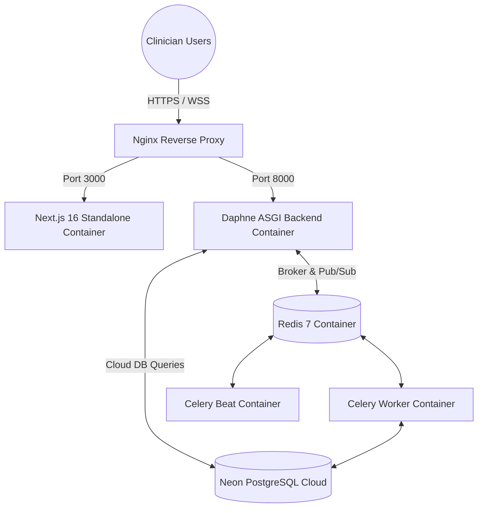

# Deployment Architecture

The deployment architecture uses a multi-container Docker topology designed for zero-downtime deployments, horizontal worker scaling, and cloud database connectivity.

---

## 1. Container Topology

### 1.1 Separation of Database & Compute
As mandated by production guidelines, **PostgreSQL is never run inside a Docker container in production**. Neon Cloud PostgreSQL provides enterprise-grade durability, automated backups, and storage tier replication, freeing the container cluster to focus purely on stateless compute.
