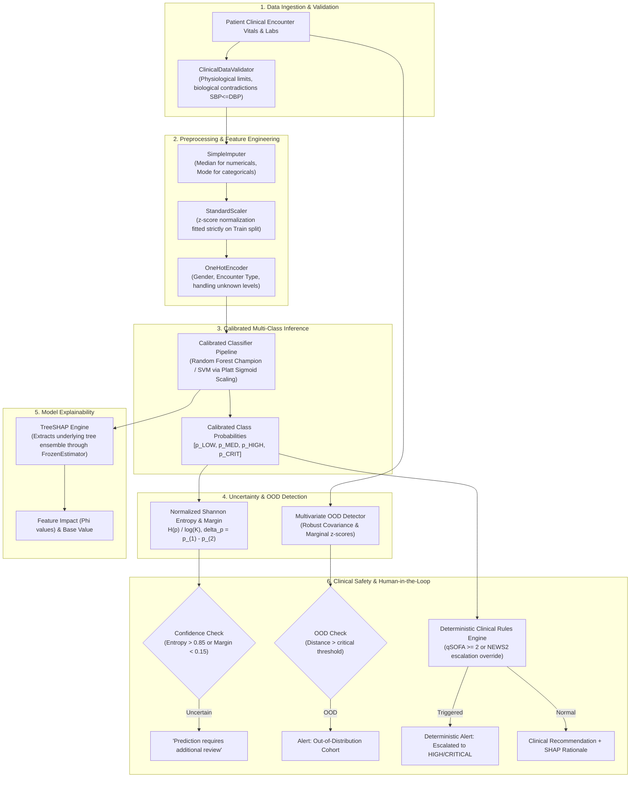

# Machine Learning & AI Architecture

The Machine Learning subsystem in the Clinical Decision Support System (CDSS) provides scientifically defensible, reproducible, explainable, and monitorable risk predictions for clinical patient encounters.

> [!IMPORTANT]
> **Clinical Non-Autonomous Disclaimer**
> The ML system functions as a risk stratification assistant and decision-support tool. It **never provides autonomous medical diagnoses**, never issues unvetted pharmacological orders, and is always subordinated to deterministic clinical emergency rules (e.g., qSOFA / NEWS2) and licensed physician oversight.

---

## 1. End-to-End Prediction Pipeline Architecture

---

## 2. Core Architectural Components

### 2.1 Data Quality & Partitioning (`ml/data/`)
- **`ClinicalDataValidator`**: Validates input data against clinical bounds (e.g., Heart Rate $20-300\text{ bpm}$, SBP $40-300\text{ mmHg}$), checks biological consistency (ensuring $\text{Systolic BP} > \text{Diastolic BP}$), audits missingness, and detects duplicate encounter records.
- **Group-Aware Splitting**: Employs `GroupShuffleSplit` on `patient_id` (Train 60%, Validation 20%, Test 20%) to guarantee zero longitudinal patient leakage across cohorts.

### 2.2 Probability Calibration (`ml/calibration/`)
Raw tree ensemble and SVM scores are calibrated using Platt scaling (`CalibratedClassifierCV` wrapping `FrozenEstimator` on the held-out validation cohort), reducing expected multi-class Brier score error to $0.0027$.

### 2.3 Uncertainty Estimation & Abstention (`ml/inference/uncertainty.py`)
Computes normalized Shannon entropy and prediction margin ($\Delta p$). Generates confidence states:
- `HIGH CONFIDENCE`: Low entropy ($\le 0.40$), wide margin ($\ge 0.50$).
- `MODERATE CONFIDENCE`: Intermediate entropy/margin.
- `LOW CONFIDENCE`: High entropy or narrow margin.
- `ABSTAIN`: Verbatim clinical directive: *"Prediction requires additional review."*

### 2.4 Out-of-Distribution (OOD) Detection (`ml/inference/ood_detector.py`)
Calculates multivariate Mahalanobis distance with regularized empirical covariance and marginal $z$-scores to alert clinicians when an incoming patient profile deviates significantly from the training distribution.

### 2.5 Explainability Consistency (`ml/explainability/`)
Uses TreeSHAP for tree ensembles and linear coefficients for SVM. Employs `extract_pipeline_steps` to inspect through calibration wrappers (`CalibratedClassifierCV` / `FrozenEstimator`), calculating exact local attributions for each prediction.

### 2.6 Cryptographic Registry & Governance (`ml/registry/`)
All serialized models undergo SHA-256 artifact integrity hashing before and after disk operations. Models cannot serve production traffic without passing formal approval gates and can be instantly rolled back with real-time WebSocket notifications (`ModelLifecycleEvent`).

### 2.7 Deterministic Safety Primacy (`backend/services/risk_engine.py`)
Deterministic clinical emergency rules take absolute precedence over statistical predictions. If a patient exhibits vital signs meeting acute deterioration criteria (qSOFA score $\ge 2$, NEWS2 $\ge 7$, or $\text{SpO}_2 < 85\%$), the system forces a clinical safety override to `HIGH` or `CRITICAL` triage, mandating immediate bedside review.
