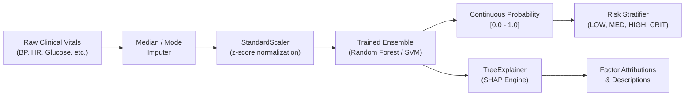

# Machine Learning Architecture

The Machine Learning subsystem operates as an integrated decision engine within the clinical application, combining predictive modeling with explainable AI.

---

## 1. Inference Pipeline Architecture

### 1.1 In-Memory Model Loader
To eliminate the latency of reloading multi-megabyte model artifacts from disk during high-frequency clinical workflows, the system employs the `ModelLoaderService`. This service:
- Maintains an in-memory thread-safe singleton cache of the active model pipeline.
- Automatically hashes and validates artifact integrity upon startup.
- Supports zero-downtime cache invalidation when a new model version is promoted via the Model Registry API.

### 1.2 Explainability via TreeSHAP
Predictions without clinical rationale are rarely trusted in healthcare. The system calculates SHAP (SHapley Additive exPlanations) values for every prediction:
$$\text{Risk Score} = \text{Base Value} + \sum_{i=1}^{M} \phi_i$$
Where $\phi_i$ represents the positive or negative attribution of clinical feature $i$.
