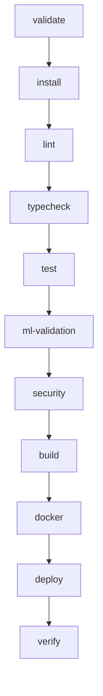

# GitLab CI/CD Architecture & Pipeline Reference — HealthNova AI

## Overview
HealthNova AI employs a **dual-pipeline architectural model**. GitHub Actions remains the primary public PR validator and repository quality engine, while GitLab CI/CD provides an enterprise mirror for pipeline orchestration, GitLab Container Registry integration, multi-tier environment tracking (`development`, `staging`, `production`), and manual clinician/DevOps release gates.

---

## 11-Stage Pipeline Lifecycle

The `.gitlab-ci.yml` orchestrates 11 deterministic stages:

1. **validate**: Backend Django configuration checks, migrations validation, database/cache availability.
2. **install**: Hermetic dependency caching for npm (`package-lock.json`) and pip (`requirements.txt`).
3. **lint**: ESLint (Next.js frontend) and Flake8 (Django backend).
4. **typecheck**: TypeScript strict checks (`tsc --noEmit`).
5. **test**: Frontend unit & route tests (Node `--test`), Backend unit & integration tests (Pytest).
6. **ml-validation**: Fast CI ML model contract tests on every commit; Scheduled Kaggle discovery/training tests.
7. **security**: Bandit SAST scanning, dependency audits, zero-secret entropy detection.
8. **build**: Next.js production compilation and Django `collectstatic`.
9. **docker**: BuildKit multi-stage non-root container image build and push to GitLab Container Registry.
10. **deploy**: Automatic Staging deployment (`develop` branch) and manual approval gate for Production (`main` branch).
11. **verify**: Post-deployment synthetic HTTP and readiness checks.

---

## Service Containers
GitLab CI uses isolated, disposable service containers:
- **PostgreSQL 15**: `POSTGRES_DB: test_db`, `POSTGRES_USER: postgres`, `POSTGRES_PASSWORD: postgres`. CI tests NEVER touch production Neon PostgreSQL.
- **Redis 7**: For Channel layer, caching, and Celery broker testing. CI tests NEVER touch production Redis.

---

## ML & Kaggle Execution Strategy
- **Fast CI**: Runs on every commit and MR. Validates feature schemas, imputers, model interfaces, inference consistency, and explainability without external network calls.
- **Scheduled Pipeline**: Triggered only on scheduled cron intervals (`CI_PIPELINE_SOURCE == "schedule"`). Executes heavy benchmark discovery and model registry tracking.
