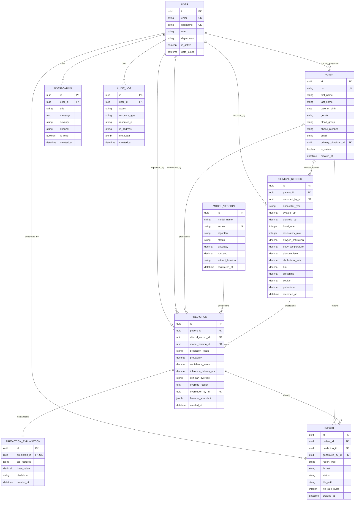

# Database Schema & Entity-Relationship Diagram

This diagram represents the actual relational data models implemented in the application.

---

## 1. Mermaid Entity-Relationship (ER) Diagram

```mermaid
erDiagram
    USER ||--o{ PATIENT : primary_physician
    USER ||--o{ CLINICAL_RECORD : recorded_by
    USER ||--o{ PREDICTION : requested_by
    USER ||--o{ PREDICTION : overridden_by
    USER ||--o{ REPORT : generated_by
    USER ||--o{ NOTIFICATION : user
    USER ||--o{ AUDIT_LOG : user

    PATIENT ||--o{ CLINICAL_RECORD : clinical_records
    PATIENT ||--o{ PREDICTION : predictions
    PATIENT ||--o{ REPORT : reports

    MODEL_VERSION ||--o{ PREDICTION : predictions

    CLINICAL_RECORD ||--o{ PREDICTION : predictions

    PREDICTION ||--|| PREDICTION_EXPLANATION : explanation
    PREDICTION ||--o{ REPORT : reports

    USER {
        uuid id PK
        string email UK
        string username UK
        string role
        string department
        boolean is_active
        datetime date_joined
    }

    PATIENT {
        uuid id PK
        string mrn UK
        string first_name
        string last_name
        date date_of_birth
        string gender
        string blood_group
        string phone_number
        string email
        uuid primary_physician_id FK
        boolean is_deleted
        datetime created_at
    }

    CLINICAL_RECORD {
        uuid id PK
        uuid patient_id FK
        uuid recorded_by_id FK
        string encounter_type
        decimal systolic_bp
        decimal diastolic_bp
        integer heart_rate
        integer respiratory_rate
        decimal oxygen_saturation
        decimal body_temperature
        decimal glucose_level
        decimal cholesterol_total
        decimal bmi
        decimal creatinine
        decimal sodium
        decimal potassium
        datetime recorded_at
    }

    MODEL_VERSION {
        uuid id PK
        string model_name
        string version UK
        string algorithm
        string status
        decimal accuracy
        decimal roc_auc
        string artifact_location
        datetime registered_at
    }

    PREDICTION {
        uuid id PK
        uuid patient_id FK
        uuid clinical_record_id FK
        uuid model_version_id FK
        string prediction_result
        decimal probability
        decimal confidence_score
        decimal inference_latency_ms
        string clinician_override
        text override_reason
        uuid overridden_by_id FK
        jsonb features_snapshot
        datetime created_at
    }

    PREDICTION_EXPLANATION {
        uuid id PK
        uuid prediction_id FK,UK
        jsonb top_features
        decimal base_value
        string disclaimer
        datetime created_at
    }

    REPORT {
        uuid id PK
        uuid patient_id FK
        uuid prediction_id FK
        uuid generated_by_id FK
        string report_type
        string format
        string status
        string file_path
        integer file_size_bytes
        datetime created_at
    }

    NOTIFICATION {
        uuid id PK
        uuid user_id FK
        string title
        text message
        string severity
        string channel
        boolean is_read
        datetime created_at
    }

    AUDIT_LOG {
        uuid id PK
        uuid user_id FK
        string action
        string resource_type
        string resource_id
        string ip_address
        jsonb metadata
        datetime created_at
    }
```
