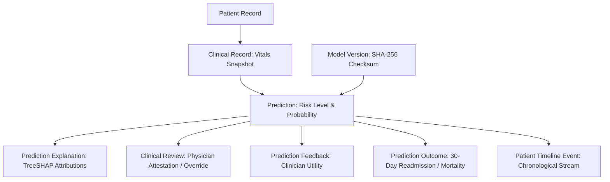

# Prediction Lineage & Provenance Architecture

## Immutable Lineage Invariant
Every clinical risk prediction generated by HealthNova AI forms an immutable chain of custody in Neon PostgreSQL linking:
1. **Patient Demographic Context** (`patients.Patient`)
2. **Clinical Observation / Encounter Vitals** (`clinical.ClinicalRecord`)
3. **Validated Model Version & Checksum** (`model_registry.ModelVersion`)
4. **Exact Input Feature Snapshot** (`Prediction.features_snapshot`)
5. **TreeSHAP Feature Attributions** (`PredictionExplanation`)
6. **Physician Review Attestation** (`predictions.ClinicalReview`)
7. **Downstream Clinical Outcomes** (`PredictionOutcomeLink`)

---

## Lineage Provenance Graph

---

## Retrospective Auditing & Reproducibility
Given any historical `prediction_id`:
- SRE, auditors, and FDA inspectors can recreate the exact inference environment using `features_snapshot` and model `checksum`.
- No row in `predictions_prediction` is ever updated or overwritten (with the exception of non-repudiable clinician override audit columns).
