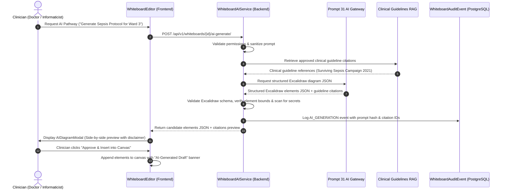

# AI Integration & Structured Diagram Generation

> **Component:** Whiteboard AI Subsystem  
> **Parent Platform:** HealthNova AI — Prompt 31 / Prompt 32  
> **Security Standard:** Zero Direct PHI Ingestion, Allowlisted Schemas, Human Review Gate  

---

## 1. Architectural Philosophy

Diagram generation via Large Language Models or specialized clinical agents presents distinct safety challenges:
1. **Hallucinated Clinical Guidance**: An unverified AI diagram might depict incorrect medication dosages, faulty triage decision trees, or unvalidated sepsis pathways.
2. **Prompt Injection / Code Injection**: Malicious or untrusted inputs embedded inside patient complaints could attempt to inject canvas manipulation scripts or exfiltrate private patient state.
3. **Non-Authoritative Invariant Violation**: An AI diagram must **never** be presented as an authoritative medical record, diagnosis, or prescription.

To address these invariants, all AI-assisted whiteboard capabilities operate through the **Prompt 31 AI Gateway & Allowlisted Tool Orchestration layer**, adhering to three core principles:
- **Strict JSON Schema Output**: The AI outputs structured JSON conforming strictly to Excalidraw element primitives (rectangles, diamonds, arrows, text labels, and containers). Raw HTML or executable JavaScript is structurally impossible.
- **Instruction Hierarchy & Context Minimization**: Clinical risk parameters passed to the AI are de-identified through `ClinicalRiskContextBuilder`. Diagram text is treated strictly as data.
- **Mandatory Pre-Insertion Clinician Approval**: AI generation never alters the active canvas in-place without human clinician review and explicit click-through confirmation.

---

## 2. Diagram Generation Pipeline



---

## 3. Structured Excalidraw JSON Schema Contract

The AI Gateway emits Excalidraw elements using a constrained subset:

```json
{
  "diagram_title": "Early Sepsis Screening & Lactate Pathway",
  "guideline_citations": [
    {
      "source": "Surviving Sepsis Campaign Guidelines 2021",
      "section": "1-Hour Bundle Protocol",
      "doi_or_url": "https://doi.org/10.1097/CCM.0000000000005337"
    }
  ],
  "elements": [
    {
      "type": "rectangle",
      "x": 100,
      "y": 100,
      "width": 260,
      "height": 70,
      "strokeColor": "#0284c7",
      "backgroundColor": "#e0f2fe",
      "fillStyle": "solid",
      "strokeWidth": 2,
      "roundness": { "type": 3 },
      "label": "Triage Assessment: qSOFA >= 2 or NEWS2 >= 5"
    },
    {
      "type": "arrow",
      "x": 230,
      "y": 170,
      "points": [[0, 0], [0, 60]],
      "strokeColor": "#64748b",
      "label": "Initiate Protocol"
    },
    {
      "type": "diamond",
      "x": 150,
      "y": 230,
      "width": 160,
      "height": 100,
      "strokeColor": "#d97706",
      "backgroundColor": "#fef3c7",
      "fillStyle": "solid",
      "strokeWidth": 2,
      "label": "Serum Lactate > 2 mmol/L?"
    }
  ],
  "safety_disclaimer": "AI-Generated Draft. Requires independent clinician review and human sign-off before implementation."
}
```

---

## 4. Visual Watermarking & Audit Trails

1. **Mandatory Disclaimer Banner**:
   Any AI-generated diagram automatically incorporates a prominent visual banner element:
   - Position: Top edge of the imported diagram block.
   - Text: `⚠️ AI-Generated Diagram Draft — Requires Human Clinician Sign-Off (Prompt 32 Non-Authoritative Invariant)`.
   - Color: Amber background (`#fffbeb`) with amber border (`#f59e0b`).
2. **Audit Logging**:
   Every invocation logs:
   - `whiteboard_id`, `user_id`, `timestamp`
   - `prompt_summary` (PII/PHI stripped)
   - `guideline_citations`
   - `element_count` generated
   - `approved_by_user` timestamp upon canvas insertion.
