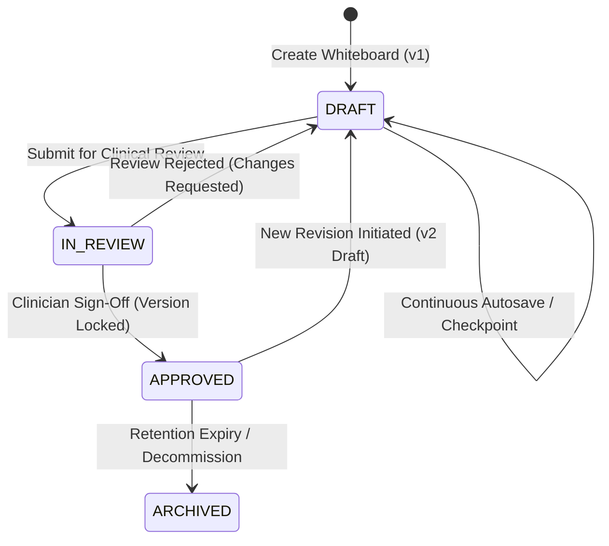

# Whiteboard Document Versioning & Immutability

> **Authoritative Database:** Neon PostgreSQL (`WhiteboardDocument`, `WhiteboardVersion`)  
> **Integrity Verification:** SHA-256 Content Hashing  

---

## 1. Versioning Philosophy

Healthcare documentation demands unalterable historical traceability. If a clinical decision flow is questioned during a morbidity and mortality (M&M) review, the exact visual state presented to the care team at that timestamp must be reproducible.

### Key Rules:
1. **Never Silently Overwrite History**: Every document mutation creates an update in `WhiteboardDocument`, and milestone actions create an immutable `WhiteboardVersion`.
2. **Deterministic Hashing**: Every version stores a `content_hash` computed as `SHA256(canonical_json(document_json))`.
3. **Approved Version Locking**: Once marked as `APPROVED` by a clinician, version $N$ is immutable. Any further modifications immediately increment the version counter to $N+1$ in `DRAFT` status.

---

## 2. Version State Transitions

---

## 3. Version Rollback & Restore Audit

Authorized users (`DOCTOR`, `ADMIN`) can restore any prior version:
1. Client requests `POST /api/v1/whiteboards/<id>/restore/` with target `version_number`.
2. Backend validates `WHITEBOARD_RESTORE` permission.
3. System loads `WhiteboardVersion` snapshot.
4. Increments `current_version` (e.g. restoring v1 when at v3 creates v4 with the contents of v1).
5. Writes an immutable audit entry to `WhiteboardAuditEvent` capturing:
   - `action`: `"RESTORE"`
   - `restored_from_version`: `1`
   - `new_version`: `4`
   - `restored_by`: User ID
6. Broadcasts `WHITEBOARD_VERSION_CREATED` to all connected collaboration clients.
